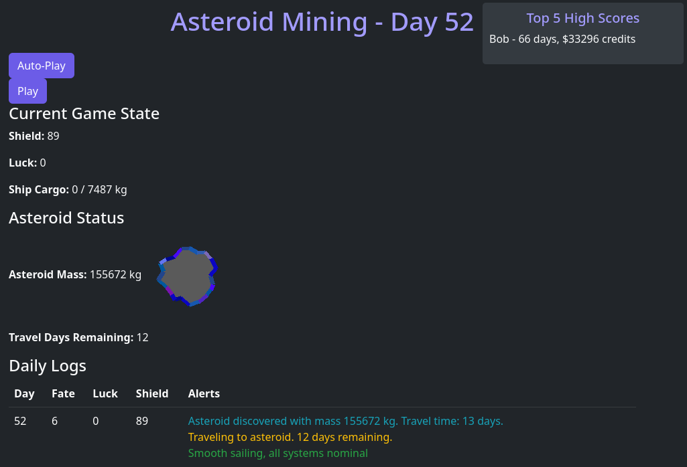

# Asteroid Mining "Game"

Each time you click "Play" you will set out on your mission to find asteroids, mine them and return the goods to base where you will be paid and receive repairs.

All decisions are made for you based on a 20 sided die and a coin flip.

Each day is met a chance to get hit by a meteorite or some space debris that can deplete your shields and end the game.

You are rewarded based on the number of days you survive + the credits you earn.

Be remembered forever by making it into the Top 5 High Scores!



# Helm deploy
```
git clone https://github.com/fullaware/asteroidmining
cd asteroidmining
helm install asteroidmining ./asteroidmining/ -n asteroidmining --create-namespace
```

# For Developers

## Run from Docker
```
docker build . -t fullaware/asteroids:latest
docker run -p 8000:8000 fullaware/asteroids:latest 
```
## OR run `docker-compose` to include MongoDB
```
docker compose up --build --force-recreate --no-deps --remove-orphans [-d]
```